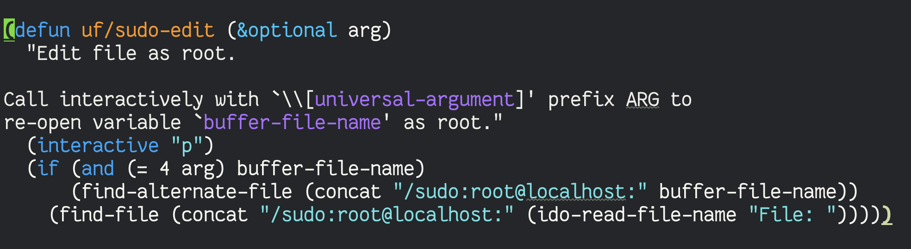

## 2022 {#2022}

### 2022-11 November {#2022-11-november}

#### 2022-11-01 Tuesday {#2022-11-01-tuesday}

&lt;2022-11-01 Tue&gt;

<!--list-separator-->

-  [2022-11-01 Tue 10:45]

    The thank you card and feedback categorisation is especially impressive 👏👏 <https://twitter.com/shubroski/status/1587136794797244417>

<!--list-separator-->

-  [2022-11-01 Tue 19:19]

    The first day of #NaNoWriMo was spent updating my notes. Basically, copying my mastodon.technology toots into my personal notes, because there isn't a way to import them here. Lesson learned: Capture all micro-blogging efforts into my PKM, and find a way to publish them separately as well.

    Posted at:

    -   <https://fosstodon.org/@vedang/109268850694142083>

#### 2022-11-08 Tuesday {#2022-11-08-tuesday}

&lt;2022-11-08 Tue&gt;

<!--list-separator-->

-  [2022-11-08 Tue 08:28]

    Hello fellow Emacsen!

    Have you taken the Emacs 2022 survey yet? If not, please take ~10 minutes of your time to fill it out! <https://emacssurvey.org/> #emacs

    -   Posted to: [Fosstodon](https://fosstodon.org/@vedang/109305912490627263), [Twitter](https://twitter.com/vedang/status/1589814902533029889)

<!--list-separator-->

-  [2022-11-08 Tue 08:44]

    This is a test to see if the capture template is working correctly. Looks like it is!

    -   Posted to: Cohost

#### 2022-11-11 Friday {#2022-11-11-friday}

&lt;2022-11-11 Fri&gt;

<!--list-separator-->

-  [2022-11-11 Fri 22:50]

    Pros of Musk buying Twitter: It's uplifting to see someone so powerful fail so spectacularly.

    Perhaps the trick to becoming better is fail fast, not care about public shaming, and keep improving.

    Cons: I don't want Twitter to die. I like it and will be sad to see it go.

    -   Posted to: [Twitter](https://twitter.com/vedang/status/1591119680420581376), [Fosstodon](https://fosstodon.org/@vedang/109326335776745453)

#### 2022-11-16 Wednesday {#2022-11-16-wednesday}

&lt;2022-11-16 Wed&gt;

<!--list-separator-->

-  [2022-11-16 Wed 10:50]

    I've asked for an archive of my Twitter data, but then I realised that I don't need it! (through a series of lucky choices).

    I've been using Pinboard for all my bookmarking since 2016. It has a feature which saves all my tweets as bookmarks!

    It also has a great API, which means downloading those tweets for local storage was straightforward.

    Thanks @Pinboard, @idlewords!

    -   Posted to: [Fosstodon](https://fosstodon.org/@vedang/109351838894032242), [Twitter](https://twitter.com/vedang/status/1592753118185656322)

    And here is the code I used 3 years ago to download my #pinboard bookmarks for local storage (#emacs, #orgmode). Ran it again now and it worked like a charm :) <https://github.com/mathcass/pinboard-org>

    -   Posted to: [Fosstodon](https://fosstodon.org/@vedang/109351842026813444), [Twitter](https://twitter.com/vedang/status/1592753617055862791)

#### 2022-11-24 Thursday {#2022-11-24-thursday}

&lt;2022-11-24 Thu&gt;

<!--list-separator-->

-  [2022-11-24 Thu 11:05]

    Every time I have to debug Docker / Podman issues, I end up wondering why I ever stopped using vagrant and simple VM boxes.

    I guess I just haven't figured out the knack to debugging Docker issues yet.

    -   Posted to: [Fosstodon](https://fosstodon.org/@vedang/109397455606420951)

#### 2022-11-25 Friday {#2022-11-25-friday}

&lt;2022-11-25 Fri&gt;

<!--list-separator-->

-  [2022-11-25 Fri 10:47]

    Woke up to a Youtube Premium notice saying they were unable to charge my credit card and my subscription will end soon. This e-mandate business had been working well for a year now, but has suddenly failed. What an unnecessary waste of time this is!

    Dear Google, just gimme one place from which I can pre-pay you manually for all the services I use, ideally for many years at once. Make it work with UPI. Why have you made taking my money so hard!

    Dear RBI, **please** work with major players to figure out what the hell is happening. Your e-mandates were working fine, now suddenly they are not, and I don't know what to do. Or just gimme a place where I can sign to declare that I'm an adult and can mange my own credit.

    -   Posted to: Just my journal at the moment.

### 2022-12 December {#2022-12-december}

#### 2022-12-02 Friday {#2022-12-02-friday}

&lt;2022-12-02 Fri&gt;

<!--list-separator-->

-  [2022-12-02 Fri 15:34]

    Every year, I'm so grateful for the effort that goes into #adventofcode ! It's so much fun! Thank you @ericwastl :)

    As usual, I think about solving the problem in some new language, but I end up doing it in #Clojure

    -   Posted to: [Fosstodon](https://fosstodon.org/@vedang/109443519114446151), [Twitter](https://twitter.com/vedang/status/1598619760714870784)

    Code show-off for day 2: [AOC 2022 Day 2 Part 1](</ox-hugo/Screenshot 2022-12-02 at 3.56.56 PM.png>)

    -   Posted to: [Fosstodon](https://fosstodon.org/@vedang/109443622554086929), Twitter

#### 2022-12-03 Saturday {#2022-12-03-saturday}

&lt;2022-12-03 Sat&gt;

<!--list-separator-->

-  [2022-12-03 Sat 09:11]

    OH: "I don't read books at all :(! I wish I would read more!"

    2 minutes later...

    "It's amazing how much I know even though I read so little!" 😂

    -   Posted to: [Twitter](https://twitter.com/vedang/status/1598886275351998464), [Fosstodon](https://fosstodon.org/@vedang/109447683786851695)

#### 2022-12-04 Sunday {#2022-12-04-sunday}

&lt;2022-12-04 Sun&gt;

<!--list-separator-->

-  [2022-12-04 Sun 11:39]

    OH after the USA - NED match: "This is the fastest that the USA has exited a middle eastern country"

    -   Posted to: Fosstodon, Twitter

#### 2022-12-14 Wednesday {#2022-12-14-wednesday}

&lt;2022-12-14 Wed&gt;

<!--list-separator-->

-  [2022-12-14 Wed 10:45]

    "Trying to be positive" and not letting negative emotions / vibes take over is proving difficult this week.

    Taking inspiration from the wise words of the Buddha: "Chill Homie! You need to let that shit go!"

    -   Posted to: Fosstodon

#### 2022-12-16 Friday {#2022-12-16-friday}

&lt;2022-12-16 Fri&gt;

<!--list-separator-->

-  [2022-12-16 Fri 10:38]

    A long time ago, I wrote a small document on what a programming editor should be able to do.

    It was part of a course where I was teaching Emacs, and I realised that I don't care about what editor you use as long as you can do these things in the editor.

    Today, someone asked me to share the document with them again, so here I am, sharing it with everyone. My request: Please reply with more / missing functionality that you think is must-have in an editor. PRs welcome!

    <https://github.com/vedang/emacs-up/blob/master/docs/02_what_a_programming_editor_should_do.org>

    -   Posted to: [Fosstodon](https://fosstodon.org/@vedang/109521652675481076), [Twitter](https://twitter.com/vedang/status/1603622069001785344)

#### 2022-12-28 Wednesday {#2022-12-28-wednesday}

&lt;2022-12-28 Wed&gt;

<!--list-separator-->

-  [2022-12-28 Wed 18:12]

    <https://matt.might.net/articles/26-languages-part1/>

    What a great article on approaches to solving Advent in new languages! Lots of food for thought here on preparation in programming!

    -   Posted to: [Fosstodon](https://fosstodon.org/@vedang/109591355118080238)

## 2023 {#2023}

### 2023-01 January {#2023-01-january}

#### 2023-01-06 Friday {#2023-01-06-friday}

&lt;2023-01-06 Fri&gt;

<!--list-separator-->

-  [2023-01-06 Fri 11:37]

    At Helpshift, we were in a crunch and unable to hire fast enough. So we converted all the QAs to Devs in the Backend team. It was the best decision we took. Not only were the QA excellent Devs themselves, they brought a different perspective to Devs and made the Devs better.

    Today, I believe that QA should exist to build end-to-end automated testing suites, fuzzers, performance benchmarking and other high value add-ons for all engineering. Their job is to build the tools that enable devs to test in creative ways and fail fast.

    -   Posted to: Twitter, [Fosstodon](https://fosstodon.org/@vedang/109640759020845475)

    This was posted as a reaction to: <https://twitter.com/championswimmer/status/1610889563337289728>:

    > At Zomato when we were at 30M active users and mobile teams of 20+ on each platform, we still didn't have QA
    >
    > And while there could have been a bunch of other things better in our engineering culture, the no-QA setup was really pivotal for the team to product a quality product

    which, in turn, was a reaction to: <https://twitter.com/_svs_/status/1610831917838127105>

    > n an early stage start-up, a QA team is a smell that engineering isn't doing engineering.
    >
    > Don't @ me, go read this -&gt; <https://www.engineeringorg.com/the-quality-muscle/>

#### 2023-01-12 Thursday {#2023-01-12-thursday}

&lt;2023-01-12 Thu&gt;

<!--list-separator-->

-  [2023-01-12 Thu 15:18]

    \#Emacs Tip of the day: Opening a file as root (screenshot attached).

    Image:  Alt-text: An image of the emacs-lisp function `uf/sudo-edit`, for editing a file as root from inside Emacs. Taken from: <https://github.com/vedang/emacs-up/blob/a42dd0638842cbcba2d1a98ab784eacd66d0ab0a/site-lisp/utility-functions.el#L139-L147>

    If you `M-x uf/sudo-edit`, it will ask for a filename and open it as root. If you `C-u M-x uf/sudo-edit`, it will reopen the file visited by the current buffer as root.

    -   Posted to: [Twitter](https://twitter.com/vedang/status/1613475185709191169), [Fosstodon](https://fosstodon.org/@vedang/109675647113394483)

#### 2023-01-26 Thursday {#2023-01-26-thursday}

&lt;2023-01-26 Thu&gt;

<!--list-separator-->

-  [2023-01-26 Thu 22:12]

    Happy Republic Day. 73 years ago today, the Constitution of #India came into effect and we became a sovereign democratic republic, the largest and most vibrant democracy in the world. Our Constitution was and continues to remain ahead of it's time: an ideal of political, economic and societal reform that we have yet to achieve.

    Thank you 🙏 to Babasaheb Ambedkar, BN Rau and the unsung heroes and heroines of the Constituent Assembly for the blood, sweat and tears they poured into drafting something so farsighted and inspirational.

    May we forever uphold the values of a true Republic Nation.

    WE, THE PEOPLE OF INDIA, having solemnly resolved to constitute India into a **SOVEREIGN DEMOCRATIC REPUBLIC** and to secure to all its citizens:

    JUSTICE, social, economic and political;

    LIBERTY of thought, expression, belief, faith and worship;

    EQUALITY of status and of opportunity;

    and to promote among them all

    FRATERNITY assuring the dignity of the individual and the unity and integrity of the Nation;

    IN OUR CONSTITUENT ASSEMBLY this twenty-sixth day of November, 1949, do HEREBY ADOPT, ENACT AND GIVE TO OURSELVES THIS CONSTITUTION.

    -   Posted to: [Fosstodon](https://fosstodon.org/@vedang/109756603119842915), [Twitter](https://twitter.com/vedang/status/1618659310074228737)

### 2023-02 February {#2023-02-february}

#### 2023-02-19 Sunday {#2023-02-19-sunday}

&lt;2023-02-19 Sun&gt;

<!--list-separator-->

-  [2023-02-19 Sun 11:16]

    What beautiful phrasing @vgr -- "the ability to doubt is not reducible to text"

    Dubito, ergo Cogito, ergo Sum is one of the deep philosophies I hold close to heart. And even so the act of it is completely non-trivial and so, so difficult.

    Hat-tip: @_svs_ on Twitter

    (Quote tweeting @_svs_ talking about VGR's latest article: <https://twitter.com/_svs_/status/1626851469340332033>)

    -   Posted to: [Twitter](https://twitter.com/vedang/status/1627182913501675520), [Fosstodon](https://fosstodon.org/@vedang/109890726306710754)
    -   VGR's article: <https://studio.ribbonfarm.com/p/text-is-all-you-need>
        -   <https://www.lesswrong.com/posts/jtoPawEhLNXNxvgTT/bing-chat-is-blatantly-aggressively-misaligned>
    -   My screenshot: 

<!--list-separator-->

-  [2023-02-19 Sun 17:02]

    I wrote a document that I thought was good, and then I read it out loud and realised it wasn't. Reading out loud helped me see the flow of the writing and the abrupt breaks and repetitions in it.

    This is a pro-tip that I will not forget the next time. #writing

    -   Posted to: [Twitter](https://twitter.com/vedang/status/1627271767227260930), [Fosstodon](https://fosstodon.org/@vedang/109891210951198022)

### 2023-03 March {#2023-03-march}

#### 2023-03-08 Wednesday {#2023-03-08-wednesday}

&lt;2023-03-08 Wed&gt;

<!--list-separator-->

-  [2023-03-08 Wed 21:06]

    In an environment with any distraction, only shallow work can be done. Such work is generally useless.

    This post courtesy of a noisy environment.

    -   Posted to: [Twitter](https://twitter.com/vedang/status/1633492850586402817), [Fosstodon](https://fosstodon.org/@vedang/109988412157049439)

#### 2023-03-18 Saturday {#2023-03-18-saturday}

&lt;2023-03-18 Sat&gt;

<!--list-separator-->

-  [2023-03-18 Sat 14:42]

    Quote tweeting:

    -   <https://twitter.com/qualmist/status/1636442651519234048>
    -   <https://assemblag.es/@qualmist/110034468030358371>

    Reading through this short and sweet paper on live programming <https://arxiv.org/abs/2303.06777>, I realised that it's been 10+ years since @worrydream's classic talks "Inventing on Principle" and "The Future of Programming". I remember seeing them and being blown away.

    I thought then, and still do, that #Clojure was the perfect scaffolding language to bring that vision to life.

    -   Posted to: [Twitter](https://twitter.com/vedang/status/1637020414659395587), [Fosstodon](https://fosstodon.org/@vedang/110043550181330399)
