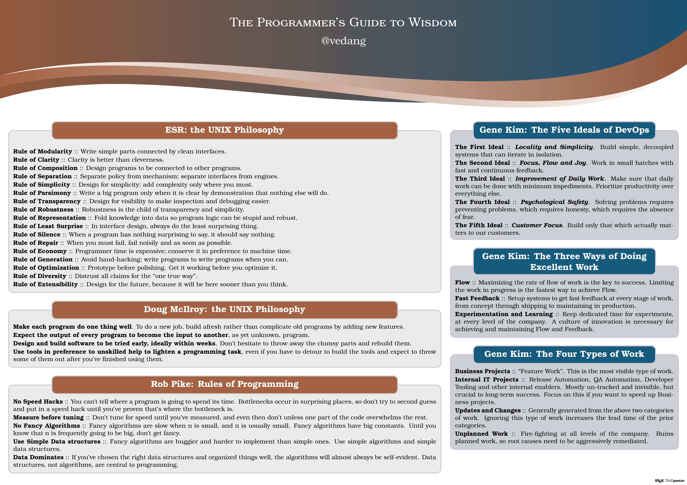

+++
title = "The Programmer's Guide to Wisdom"
author = ["Vedang Manerikar"]
date = 2020-08-22T17:15:00+05:30
lastmod = 2020-08-22T18:04:31+05:30
tags = ["programming", "wisdom"]
categories = ["programming"]
draft = false
creator = "Emacs 28.0.50 (Org mode 9.3.7 + ox-hugo)"
+++

This poster captures timeless advice on programming, I keep a copy on
my desk to read whenever I can.



I collect such deeply useful and universal advice [under the tag
wisdom](/tags/wisdom/), if you want to read more posts of this kind.
